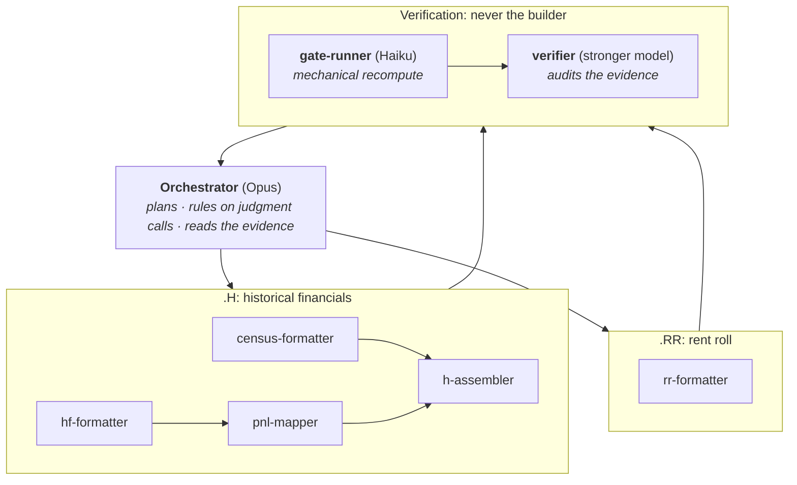

# Agentic Underwriting

A multi-agent Claude Code system that turns raw senior-housing operator exports (a T12 income
statement, a monthly census, a rent roll) into finished, reconciled underwriting model tabs.

Every acquisition an underwriting team looks at arrives as a pile of operator files in a different
shape than the last one. Before anyone can form an opinion on a deal, that data has to be conformed
to the firm's model and tied back to the operator's own totals. An underwriter on the team put that
work at **up to a full day per deal, and that estimate was for building the tabs, before anyone
verified them.** It's a day of analyst capacity spent on formatting rather than analysis.

That's an agent-shaped problem: high volume, pattern-heavy, needs domain judgment but not
creativity, and above all it's checkable. So I designed and built a system for it during my
Investments internship at Oakmont Management Group, where it ran live on real acquisitions.

### At a glance

| | |
| :-- | :-- |
| **What it does** | Converts raw operator financials, census, and rent rolls into finished model tabs, reconciled to the operator's own totals |
| **Time per deal** | Up to a full workday of manual conformance, down to **about an hour**. The new hour *includes* the verification the old day didn't |
| **Proven on** | 8 senior-housing communities across 7 live acquisitions, plus a fully synthetic demo deal |
| **Handles** | 5 operator rent-roll export families (RealPage OneSite, Yardi, ALIS, Watermark, MorningStar) through one pipeline |
| **Correctness** | Every rebuilt figure ties to the operator's reported totals to the cent, across all 12 months, or the run stops |
| **Built with** | Claude Code (Opus / Sonnet / Haiku), PowerShell, Excel COM · 14,345 lines of PowerShell in the full system (this clone ships the ~3,000-line engine plus one caller), 5 skills, 8 sub-agents, 15 reference docs |
| **Origin** | Self-initiated. I proposed it, designed it, and shipped it; it was not an assigned project |

**Published with Oakmont's permission.** This repo demonstrates the *process*: the agent
orchestration, the context engineering, and the validation architecture. Every piece of deal data
has been removed. The included example deal, **Aster Ridge Senior Living**, is entirely
fabricated, and real deals are referenced only by anonymous labels (Deal A, Deal B, …).

---

## The problem

Every operator runs different property-management software, names their general-ledger accounts
differently, and exports in a different layout. One community's "Resident Assistance Fee" is
another's "Level of Care Income" and the model's `Care Revenue`. A rent roll from RealPage OneSite
shares almost nothing structurally with one from ALIS or Watermark: different columns, different
subtotal conventions, sometimes no square footage at all.

Conforming that by hand is slow, and the slowness is the smaller problem. The real cost is that
it's *undifferentiated*: the same decisions, made again, on a new spreadsheet, by someone whose
actual job is deciding whether the firm should buy the building. The analysis (what the rent
upside really is, whether the expense base is sustainable, what the seller is hiding in "other
income") is what the team is paid for, and it's what gets squeezed when conformance eats the day.

The goal was never to remove the underwriter from the loop. It was to move them to the front of it:
hand them a conformed, reconciled, fully-cited model tab and a short list of flagged judgment calls,
so the day goes to analysis instead of formatting.

## What it produces

Two deliverables, each a finished tab in the firm's underwriting model.

### `.H`: historical financials

From a raw twelve-month P&L plus a monthly census to a linked five-tab build: **Census → Formatted
HF → PnL Mapping → the assembled `.H` tab.** The operator's chart of accounts is regrouped into the
firm's revenue groups and expense departments while preserving their original codes and labels;
every line is then tagged with a category drawn verbatim from a master list; the assembled tab
pulls detail through by lookup, rolls it up with `SUMIFS`, and carries two reconciliation checks
that tie rebuilt revenue and rebuilt expense back to the operator's own subtotals across all twelve
months.

### `.RR`: rent roll

From a raw operator export to a per-unit roster plus a derived analysis table. This is the
half that required the most reverse engineering, because there is no standard. Five export families
are supported, each worked out from a live deal:

| Family | What made it its own problem |
| :-- | :-- |
| **RealPage OneSite** | The baseline family; subtotal rows per wing, second occupants folded into the primary unit's line |
| **Yardi** | Flat export, no subtotal rows to reconcile against, so totals have to be rebuilt from raw column sums |
| **ALIS** | No square footage and no care column at all; care level has to be inferred from charge codes, and its `al-a`/`al-b` groupings are *buildings*, not care tiers |
| **Watermark** | One column per charge type, no subtotals, rents already un-prorated (so the usual gross-up would double-count) |
| **MorningStar** | Care level split across three separate columns; the raw file repeats an entire section, so a naive column sum doubles every figure |

The build produces the per-unit block (unit, type, square footage, care level, capacity, occupancy,
move-in date, market and in-place rent, care charges, second-resident fees) and then derives what
the underwriter actually reasons about: unit mix by care level and rent tier, occupancy, the spread
between asking and in-place rent, second-resident utilization, and trailing move-in windows that
show where the market is actually clearing. All of it reconciles back to the operator's own totals.

## The architecture

The instinct is to hand the whole job to one capable model. That fails three ways: context gets
polluted, the model that made an interpretation error is the same one you'd ask to catch it, and
the most expensive model ends up doing mechanical work.

Instead the pipeline decomposes into narrow specialists, following the planner/worker split in
[Cursor's research on agent-swarm economics](https://cursor.com/blog/agent-swarm-model-economics):
**one orchestrator that reasons, disposable workers that grind, and a verification chain the
builders never touch.** The orchestrator holds the plan and the financial-correctness calls but
never ingests a sheet dump and never builds anything itself.



Within the `.H` run, census and HF formatting execute concurrently. The census builds in its
own scratch workbook so two Excel COM automations never contend for a file. Mapping,
assembly, and verification then run serially because each consumes the previous stage's output. The
`.RR` side runs the same shape, with a triage ladder (bounce-once / defect ledger / stop) between
its gate run and its verifier.

Three principles that came out of running this live rather than from theory:

1. **Model tiers are seats, not upgrades.** Opus reasons, Sonnet grinds, Haiku measures. The
   cheapest model gets exactly one kind of job (deterministic recompute with zero judgment) and
   is always backstopped by a stronger, different-model auditor that sample-checks its evidence.
   A cheap instrument is trustworthy when something smarter reads its gauges.
2. **The verifier is never the builder,** and runs on a different model by design. Same-model
   verification re-makes the same interpretation errors; different-model verification catches them.
   On the demo build, the `.RR` verifier caught two errors in the gate instrument's own evidence
   and fell back to a full independent recompute.
3. **Sub-agents return compact results, never transcripts.** The orchestrator gets row numbers,
   check readings, and flags. Context budget goes to decisions, not scrollback.

## The trust architecture

An underwriting model nobody can verify is a liability. Four gates run on every
build, and a failed gate halts the run. Nothing auto-corrects.

| Gate | What it proves |
| :-- | :-- |
| **Reconcile-before-build** | Leaf lines sum to the operator's own subtotals across all 12 months. A non-zero diff means a dropped, doubled, or misbucketed line |
| **Zero formula errors** | Scanned via `SpecialCells` after a full recalc, not by string-matching `#`, which false-fires on headers like `#Apts` and misses real error codes, which marshal as integers |
| **PnL map check** | Every line carries a tag verbatim from the master list. The agents cannot invent a category to make something fit |
| **GATE 0 read-back** | The saved file is reopened cold and the things formulas can't prove are asserted directly: styling, census completeness, and silent null writes |

The rule behind all four: a check that cannot fail is not a check. Every gate exists because something
once shipped without it. GATE 0 was added after a build passed every arithmetic test while quietly
writing blanks into a tab. An empty cell read by a formula returns `0`, so the sums tied and the
run reported success.

Discipline around the gates:

- **Builds stop at v1.** Verifier findings are reported to the human, never silently auto-fixed
  into a v2. Version numbers advance only after sign-off.
- **Builders never overwrite inputs.** Every deliverable is a new `_v#` copy; superseded versions
  move to an `arc/` folder, never deleted.
- **Imperfect input data gets a Notes tab as sheet 1** with the defect, who ruled on it, the impact on
  specific figures, and what to request from the broker. Judgment calls ship visible, not buried.

## Guardrails as code, not as prose

Rules that only live in an instructions file eventually get broken. The two that had already caused
real damage are enforced by a `PreToolUse` hook
([guard-hard-rules.ps1](.claude/hooks/guard-hard-rules.ps1)) that inspects every shell command
before it runs and refuses it:

- **Blanket Excel process kills.** A COM-automated Excel is windowless for its entire life, so the
  "obvious" cleanup sweep force-kills a *concurrent* build's Excel mid-save. Cleanup is instead
  PID/lockfile-scoped, which is what makes it safe to run six terminals of parallel deal builds.
- **COM `SaveAs` to OneDrive-synced paths,** which hangs silently with no error.

The meta-rule in [CLAUDE.md](.claude/CLAUDE.md): when a written rule gets broken anyway, that's a
bug against the rulebook. Fix it by adding a hook, not by writing the sentence louder.

## Context engineering

The other half of the system is everything the agents know before they start:

- **[CLAUDE.md](.claude/CLAUDE.md)**: a deliberately lean rulebook, one line per rule, rationale
  delegated to the reference docs each rule points at.
- **Five skills** ([.claude/skills/](.claude/skills)): `census-formatting`, `hf-formatting`,
  `pnl-mapping`, `rr-formatting`, and the `h-underwrite` capstone orchestrator, each with a
  `References/` folder holding layout contracts, locked design rules, and worked examples.
  [H-PIPELINE-ORCHESTRATION.md](.claude/skills/H-PIPELINE-ORCHESTRATION.md) maps how they connect.
- **Eight agent definitions** ([.claude/agents/](.claude/agents)): five builders
  (`census-formatter`, `hf-formatter`, `pnl-mapper`, `h-assembler`, `rr-formatter`), one mechanical
  `gate-runner` shared by both pipelines, and two judgment verifiers (`h-verifier`, `rr-verifier`),
  each with a tools list scoped to its job.
- **A reusable build engine** ([Investments/lib/](Investments/lib)): the Excel COM layer
  (`HF-Build-Lib`, `RR-Build-Lib`, `H-Assembly-Lib`, `Diff-HTab`) with tracked Excel lifecycle,
  culture-safe writes, styling writers, and the diff harness used for regression testing builds.
- **Persistent memory**: environment facts learned the hard way (COM pitfalls, export-family quirks, silent
  failure modes) live in a memory system outside the repo and are referenced by slug from the
  rulebook, so sessions stop re-discovering the same landmines.

## The demo deal: Aster Ridge (fully synthetic)

`Investments/Data/Transactions/Aster Ridge (Demo)/` contains a complete worked example: an 84-unit
fictional community (40 IL / 30 AL / 14 MC) with a fabricated T12, census, and OneSite-style rent
roll, plus the finished `.H` and `.RR` models **produced by running this pipeline on those
inputs**: parallel builders, scoped gate checks after every stage, one bounce-back, and both
different-model judgment audits. The outputs are real pipeline output on fake data. Both `.H`
reconciliation Checks read `0.00` across all twelve months and the T12 column (synthetic annuals:
total revenue $5,041,509, EBITDAR $1,614,832), and all four `.RR` money streams tie to the operator
export to the cent.

Two artifacts of that run are worth pointing at. The orchestrator's GATE-0 read-back caught a real
defect in the *fabricated inputs* before any stage ran: month headers whose displayed text looked
right but whose underlying date serials decoded to the wrong year. And the `.RR` verifier's
sample-audit caught two errors in the gate instrument's own evidence. Both are exactly the failure
classes those layers exist for.

> **Every number in this repo is fabricated.** Aster Ridge does not exist. Its rents, financials,
> census, and residents were generated from the spec in `FABRICATION-SPEC.md` specifically for this
> public demonstration. Real deals are referenced only by anonymous label, and their data, models,
> and the ~40 deal-specific caller scripts stay in the private team repo. This clone ships the
> engine, the skills and agents, one caller-contract example
> ([Build-AsterRidge-HF.ps1](Investments/scripts/Build-AsterRidge-HF.ps1), the script the HF stage
> actually ran for this demo), the synthetic-data generator
> ([Build-AsterRidge-Inputs.ps1](Investments/scripts/Build-AsterRidge-Inputs.ps1)), and the
> rent-roll engine's config contract worked example
> ([Investments/lib/examples/](Investments/lib/examples)).

## Environment notes

- **Windows + Excel COM via PowerShell, no Python.** The corporate box has no Python runtime, so
  every workbook operation goes through Excel's COM API, which is where most of the rules
  come from (culture-sensitive writes, recalc-before-save, silent `SaveAs` hangs, error cells
  marshaling as `Int32`, OneDrive moving files mid-session).
- **Batched COM, not scripts-per-step.** Excel-touching agents drive COM natively in few large
  calls; one early run burned 93 tool calls and 42 minutes on write-script → invoke → read-output
  round-trips for work that takes about 20 native calls.
- **Everything reconciles or the run stops.** No gate auto-fixes; a failed gate halts and reports.

## What I'd do next

The gaps, in the order I'd close them:

1. **Instrument the runs.** The workday-to-an-hour figure comes from an underwriter's estimate of
   the manual process and my own observation of the automated one, not from measurement. A
   per-run log (deal, stage, wall-clock, flags raised, reconcile diff) across the next ten deals
   would make it defensible and show where the remaining hour actually goes.
2. **Push more orchestration into deterministic code.** Stage sequencing, retries, and the triage
   ladder are decided by the orchestrating model each run. The repeatable spine of that belongs in
   software, with the model reserved for calls that genuinely need judgment.
3. **Make a new export family a configuration change,** not a reverse-engineering project. The
   rent-roll engine's config contract is the start of this; the sixth family should be an afternoon.
4. **Golden-file regression tests in CI.** `Diff-HTab` already diffs a rebuild against a known-good
   model; running it automatically on every skill change would catch rule regressions before the
   next live deal does.

## Repository map

```
.claude/
├── CLAUDE.md                    # the lean rulebook
├── agents/                      # 8 agent definitions (builders, gate-runner, verifiers)
├── hooks/                       # PreToolUse guard: hard rules enforced in code
└── skills/                      # 5 skills + the pipeline orchestration map
Investments/
├── lib/                         # reusable Excel COM build engine (PowerShell)
├── scripts/                     # genericized caller-contract example
├── Docs/MD Files/               # deep pipeline reference + a friction retro
└── Data/Transactions/
    └── Aster Ridge (Demo)/      # the fully synthetic worked example (inputs + outputs)
```

---

## About

I'm **Ryan Morris**, graduating **May 2027**. This project came out of noticing that the real
constraint on an underwriting team wasn't analytical capability. It was how much of the week went
to data conformance before the analysis could start. Closing that gap meant learning to build
agent systems properly: roughly 150 hours of my own time that summer across eight of Anthropic's
courses and Chip Huyen's *AI Engineering*, then iterating the result against live deals.

I'm looking for full-time work after graduation, particularly **forward-deployed engineering and
applied-AI roles in finance**. I'm always glad to talk about agent architecture, verification
design, or why senior-housing rent rolls are the way they are.

- **Email**: [ryantimmorris@gmail.com](mailto:ryantimmorris@gmail.com)
- **LinkedIn**: [linkedin.com/in/ryantimmorris](https://www.linkedin.com/in/ryantimmorris)
- **GitHub**: [@RTM-Source](https://github.com/RTM-Source)

*Built summer 2026 during an Investments internship at Oakmont Management Group. Process published
with permission; all deal information removed or fabricated.*
